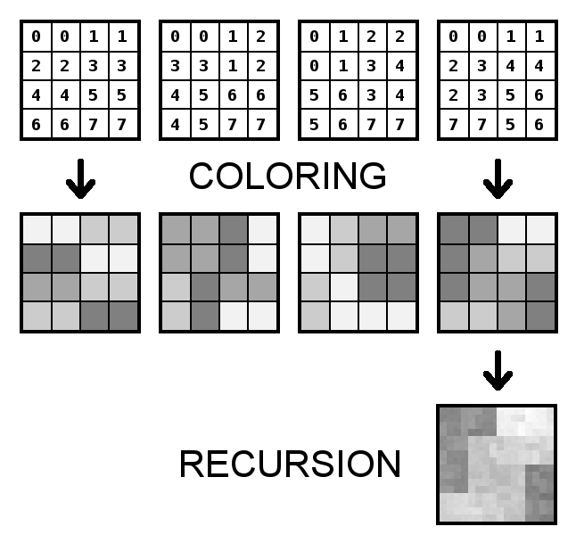
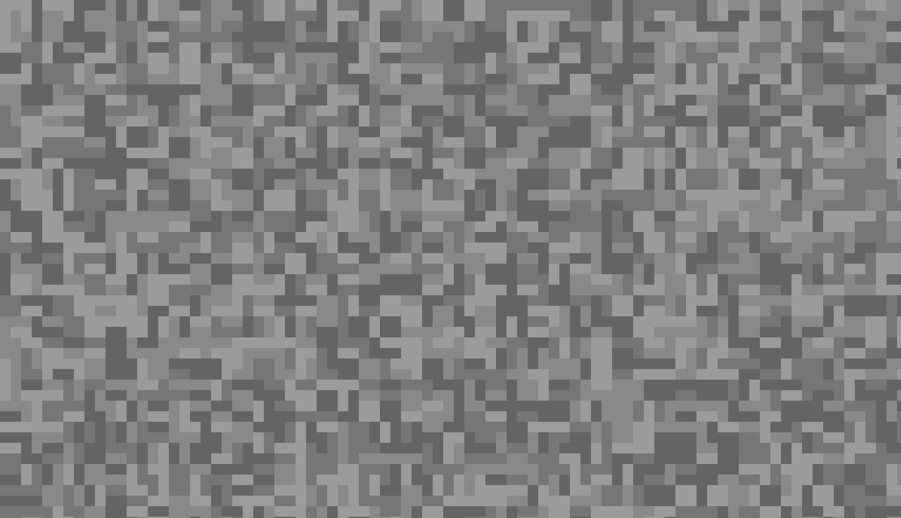
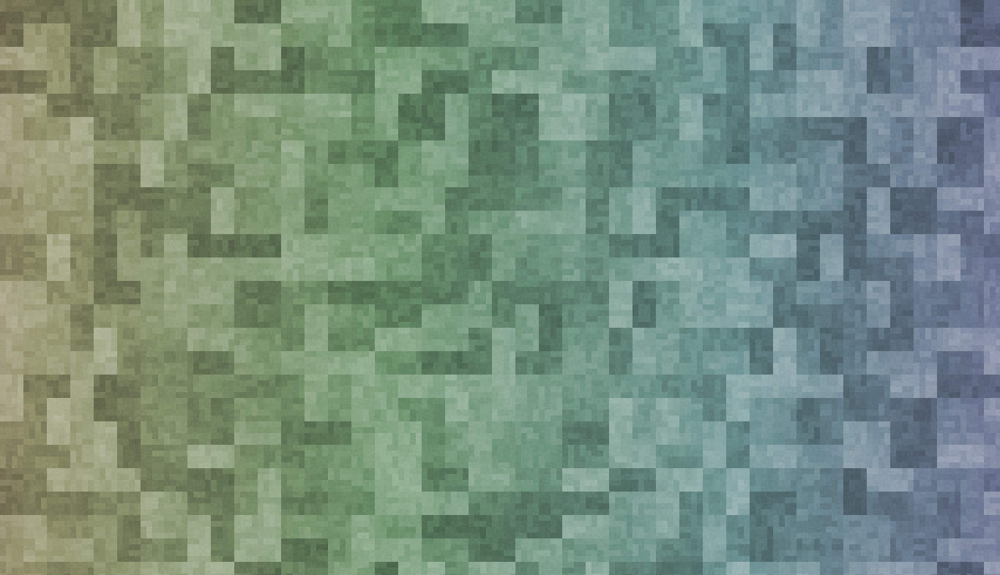
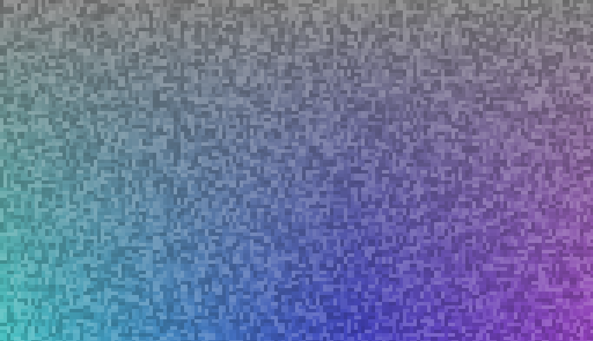
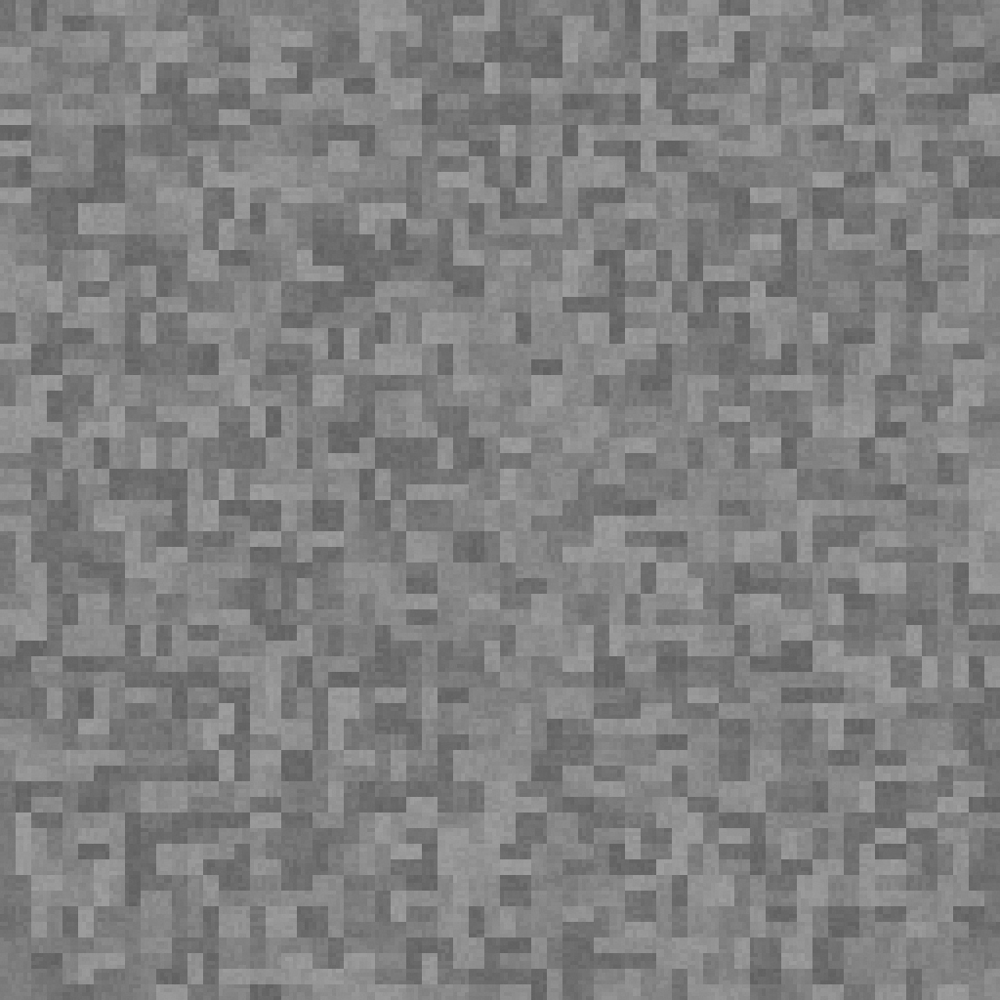
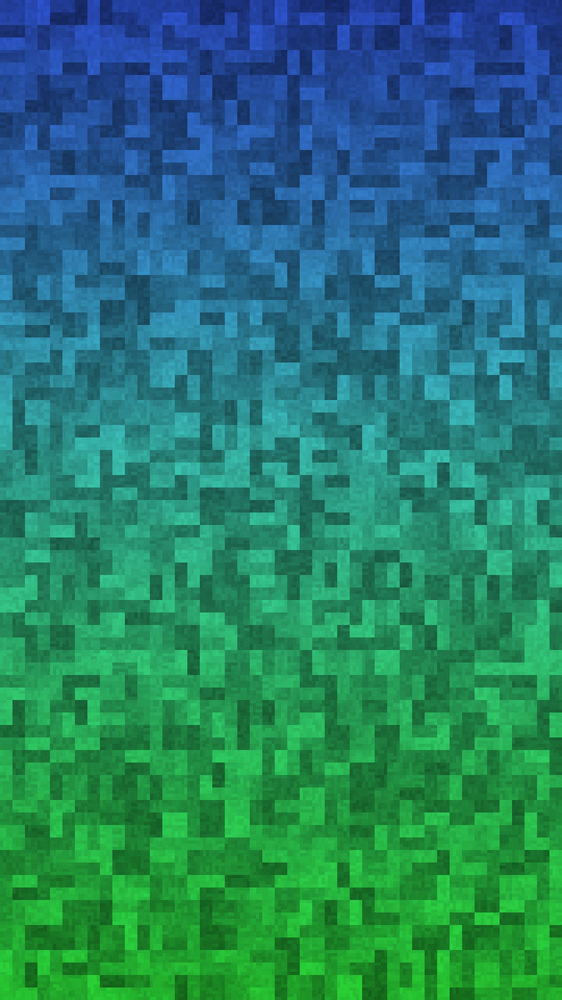
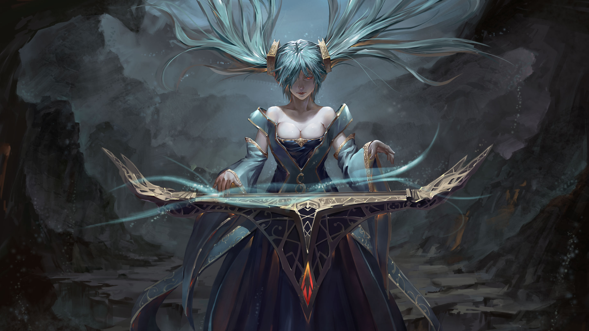
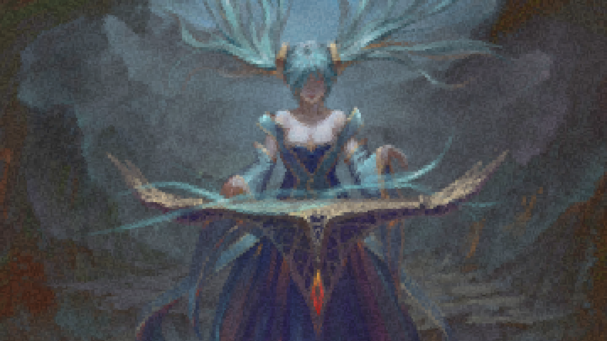
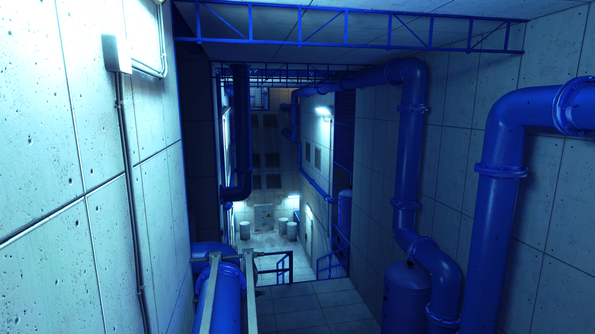
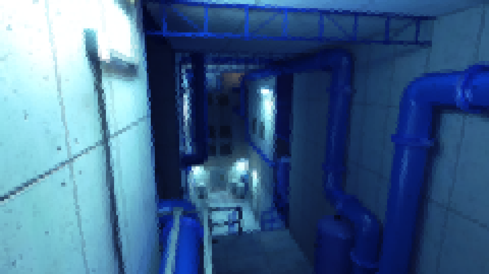

# Agrock
Algorithmically generated rock textures.

## How it works

## Examples

## A post processed example

(After some color and contrast adjustments with GIMP)

## Weird "pixelate" filter

